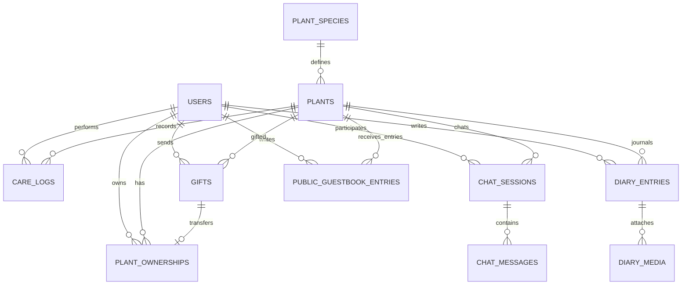

# 식물 성장형 선물 플랫폼 DB 스키마

## 1. ERD



## 2. 회원

### `users`

| 컬럼 | 타입 | 설명 |
|---|---|---|
| id | BIGSERIAL PK | 사용자 ID |
| email | VARCHAR(255) UNIQUE | 이메일 또는 구글 계정 이메일 |
| password_hash | VARCHAR(255) NULL | 일반 로그인용 암호화 비밀번호 |
| auth_provider | VARCHAR(20) | LOCAL, GOOGLE |
| google_subject | VARCHAR(255) UNIQUE NULL | 구글 계정 고유 식별자(sub) |
| nickname | VARCHAR(50) UNIQUE | 닉네임 |
| profile_image_url | TEXT NULL | 프로필 이미지 |
| status | VARCHAR(20) | ACTIVE, WITHDRAWN |
| created_at | TIMESTAMPTZ | 가입일 |
| updated_at | TIMESTAMPTZ | 수정일 |

---

## 3. 식물 백과사전

### `plant_species`

| 컬럼 | 타입 | 설명 |
|---|---|---|
| id | BIGSERIAL PK | 식물 종류 ID |
| image_url | TEXT NULL | 대표 이미지 |
| created_at | TIMESTAMPTZ | 등록일 |
| updated_at | TIMESTAMPTZ | 수정일 |

---

## 4. 사용자 식물

### `plants`

| 컬럼 | 타입 | 설명 |
|---|---|---|
| id | BIGSERIAL PK | 식물 ID |
| species_id | BIGINT FK | 식물 종류 |
| name | VARCHAR(50) | 사용자가 지은 이름 |
| growth_score | SMALLINT | 성장도 0~100 |
| positive_energy | INTEGER | 긍정 에너지 |
| negative_energy | INTEGER | 부정 에너지 |
| mood | VARCHAR(30) NULL | 현재 기분 |
| status | VARCHAR(20) | GROWING, GIFT_READY, GIFTED |
| adopted_at | TIMESTAMPTZ | 입양일 |
| created_at | TIMESTAMPTZ | 생성일 |
| updated_at | TIMESTAMPTZ | 수정일 |

### 성장 단계 계산

```text
0~4    → SEED
5~19   → COTYLEDON
20~39  → TRUE_LEAF
40~69  → BUD
70~100 → FLOWER
```

### 성장 성향 계산

```text
positive_energy >= negative_energy → POSITIVE
positive_energy < negative_energy  → NEGATIVE
```

`growth_stage`와 `growth_tendency`는 중복 저장하지 않고 조회 시 계산한다.

### 성장 형태 계산 예시

```sql
CASE
    WHEN positive_energy >= negative_energy THEN
        CASE
            WHEN growth_score BETWEEN 0 AND 4 THEN '씨앗'
            WHEN growth_score BETWEEN 5 AND 19 THEN '싱그러운 떡잎'
            WHEN growth_score BETWEEN 20 AND 39 THEN '생명력 넘치는 본잎'
            WHEN growth_score BETWEEN 40 AND 69 THEN '희망을 품은 봉오리'
            ELSE '축복의 꽃'
        END
    ELSE
        CASE
            WHEN growth_score BETWEEN 0 AND 4 THEN '심연에서 속삭이는 씨앗'
            WHEN growth_score BETWEEN 5 AND 19 THEN '기어 다니는 심연의 떡잎'
            WHEN growth_score BETWEEN 20 AND 39 THEN '저주받은 광기의 본잎'
            WHEN growth_score BETWEEN 40 AND 69 THEN '뒤틀린 황천의 봉오리'
            ELSE '종말의 꽃'
        END
END
```

---

## 5. 식물 소유권

### `plant_ownerships`

식물을 선물했을 때 기존 기록을 보존하면서 소유권을 이전한다.

| 컬럼 | 타입 | 설명 |
|---|---|---|
| id | BIGSERIAL PK | 소유권 기록 ID |
| plant_id | BIGINT FK | 식물 ID |
| owner_user_id | BIGINT FK | 소유 사용자 |
| acquisition_type | VARCHAR(20) | ADOPTION, GIFT |
| gift_id | BIGINT FK NULL | 관련 선물 ID |
| started_at | TIMESTAMPTZ | 소유 시작일 |
| ended_at | TIMESTAMPTZ NULL | 소유 종료일 |

`ended_at IS NULL`인 기록이 현재 소유권이다. 한 식물에는 현재 소유권이 하나만 존재해야 한다.

---

## 6. 돌봄 행동

### `care_logs`

| 컬럼 | 타입 | 설명 |
|---|---|---|
| id | BIGSERIAL PK | 행동 기록 ID |
| plant_id | BIGINT FK | 대상 식물 |
| user_id | BIGINT FK | 행동 사용자 |
| action_type | VARCHAR(30) | PRAISE, PET, WATER, SUNLIGHT |
| growth_delta | SMALLINT | 성장도 변화량 |
| positive_delta | INTEGER | 긍정 에너지 변화량 |
| negative_delta | INTEGER | 부정 에너지 변화량 |
| note | TEXT NULL | 행동 관련 기록 |
| created_at | TIMESTAMPTZ | 행동 시간 |

성장 수치 변경과 돌봄 기록 생성은 하나의 트랜잭션으로 처리한다.

---

## 7. AI 식물 대화

### `chat_sessions`

| 컬럼 | 타입 | 설명 |
|---|---|---|
| id | BIGSERIAL PK | 대화 세션 ID |
| plant_id | BIGINT FK | 대화 식물 |
| user_id | BIGINT FK | 대화 사용자 |
| started_at | TIMESTAMPTZ | 대화 시작 |
| ended_at | TIMESTAMPTZ NULL | 대화 종료 |

### `chat_messages`

| 컬럼 | 타입 | 설명 |
|---|---|---|
| id | BIGSERIAL PK | 메시지 ID |
| session_id | BIGINT FK | 대화 세션 |
| role | VARCHAR(20) | USER, PLANT, SYSTEM |
| content | TEXT | 메시지 내용 |
| positive_delta | INTEGER | 대화로 발생한 긍정 에너지 |
| negative_delta | INTEGER | 대화로 발생한 부정 에너지 |
| created_at | TIMESTAMPTZ | 전송 시간 |

에너지 변화량은 사용자 메시지를 분석한 결과에 기록한다.

---

## 8. 성장일기

### `diary_entries`

| 컬럼 | 타입 | 설명 |
|---|---|---|
| id | BIGSERIAL PK | 성장일기 ID |
| plant_id | BIGINT FK | 대상 식물 |
| author_user_id | BIGINT FK | 작성 사용자 |
| title | VARCHAR(150) NULL | 제목 |
| content | TEXT | 일기 내용 |
| source_type | VARCHAR(20) | USER, AI |
| mood_snapshot | VARCHAR(30) NULL | 작성 당시 기분 |
| growth_score_snapshot | SMALLINT | 작성 당시 성장도 |
| positive_energy_snapshot | INTEGER | 당시 긍정 에너지 |
| negative_energy_snapshot | INTEGER | 당시 부정 에너지 |
| growth_stage_snapshot | VARCHAR(20) | 당시 성장 단계 |
| growth_tendency_snapshot | VARCHAR(20) | 당시 성장 성향 |
| is_public | BOOLEAN | 성장일기 공개 여부 |
| diary_at | TIMESTAMPTZ | 일기 기준 시간 |
| created_at | TIMESTAMPTZ | 생성일 |
| updated_at | TIMESTAMPTZ | 수정일 |

AI가 작성한 일기를 사용자가 수정해도 `source_type`은 `AI`로 유지하고 수정 시간만 갱신한다.

### `diary_media`

| 컬럼 | 타입 | 설명 |
|---|---|---|
| id | BIGSERIAL PK | 미디어 ID |
| diary_entry_id | BIGINT FK | 성장일기 ID |
| media_type | VARCHAR(20) | IMAGE, VIDEO |
| media_url | TEXT | 파일 주소 |
| sort_order | INTEGER | 표시 순서 |
| created_at | TIMESTAMPTZ | 등록일 |

---

## 9. 식물 선물

### `gifts`

기념일이나 전달 희망일을 관리하지 않고 실제 선물한 날짜만 기록한다.

| 컬럼 | 타입 | 설명 |
|---|---|---|
| id | BIGSERIAL PK | 선물 ID |
| plant_id | BIGINT FK | 선물 식물 |
| sender_user_id | BIGINT FK | 보내는 사용자 |
| recipient_user_id | BIGINT FK NULL | 가입된 수신 사용자 |
| recipient_name | VARCHAR(50) | 받는 사람 이름 |
| gifted_on | DATE | 실제로 선물한 날짜 |
| message_card | TEXT NULL | 메시지 카드 |
| status | VARCHAR(20) | READY, SENT, ACCEPTED, CANCELLED |
| claim_code_hash | VARCHAR(255) NULL | 선물 등록 코드 |
| accepted_at | TIMESTAMPTZ NULL | 인수 완료 시간 |
| created_at | TIMESTAMPTZ | 생성일 |
| updated_at | TIMESTAMPTZ | 수정일 |

선물 수락 시 다음 작업을 하나의 트랜잭션으로 처리한다.

1. 기존 `plant_ownerships.ended_at` 기록
2. 새로운 소유권 기록 생성
3. `gifts.status`를 `ACCEPTED`로 변경
4. 식물의 기존 성장일기와 관리 기록 연결 유지

---

## 10. 전체 공개 방명록

### `public_guestbook_entries`

방명록에는 받는 사람이나 공개 범위를 저장하지 않는다. 모든 방명록은 전체 공개된다.

| 컬럼 | 타입 | 설명 |
|---|---|---|
| id | BIGSERIAL PK | 방명록 ID |
| plant_id | BIGINT FK | 방명록 대상 식물 |
| author_user_id | BIGINT FK | 작성 사용자 |
| nickname_snapshot | VARCHAR(50) | 작성 당시 닉네임 |
| content | VARCHAR(500) | 방명록 내용 |
| created_at | TIMESTAMPTZ | 작성일 |
| updated_at | TIMESTAMPTZ | 수정일 |

---

## 11. 핵심 제약조건

```sql
ALTER TABLE plants
    ADD CONSTRAINT chk_plants_growth_score
    CHECK (growth_score BETWEEN 0 AND 100);

ALTER TABLE plants
    ADD CONSTRAINT chk_plants_positive_energy
    CHECK (positive_energy >= 0);

ALTER TABLE plants
    ADD CONSTRAINT chk_plants_negative_energy
    CHECK (negative_energy >= 0);

ALTER TABLE diary_entries
    ADD CONSTRAINT chk_diary_growth_score
    CHECK (growth_score_snapshot BETWEEN 0 AND 100);

CREATE UNIQUE INDEX uq_active_plant_owner
    ON plant_ownerships (plant_id)
    WHERE ended_at IS NULL;
```

## 12. 권장 인덱스

```sql
CREATE INDEX idx_plants_species
    ON plants (species_id);

CREATE INDEX idx_ownerships_owner_active
    ON plant_ownerships (owner_user_id, ended_at);

CREATE INDEX idx_care_logs_plant_created
    ON care_logs (plant_id, created_at DESC);

CREATE INDEX idx_chat_sessions_plant
    ON chat_sessions (plant_id, started_at DESC);

CREATE INDEX idx_chat_messages_session
    ON chat_messages (session_id, created_at);

CREATE INDEX idx_diary_entries_plant_date
    ON diary_entries (plant_id, diary_at DESC);

CREATE INDEX idx_public_diary
    ON diary_entries (diary_at DESC)
    WHERE is_public = TRUE;

CREATE INDEX idx_guestbook_plant_created
    ON public_guestbook_entries (plant_id, created_at DESC);

CREATE INDEX idx_gifts_recipient
    ON gifts (recipient_user_id, gifted_on DESC);
```
